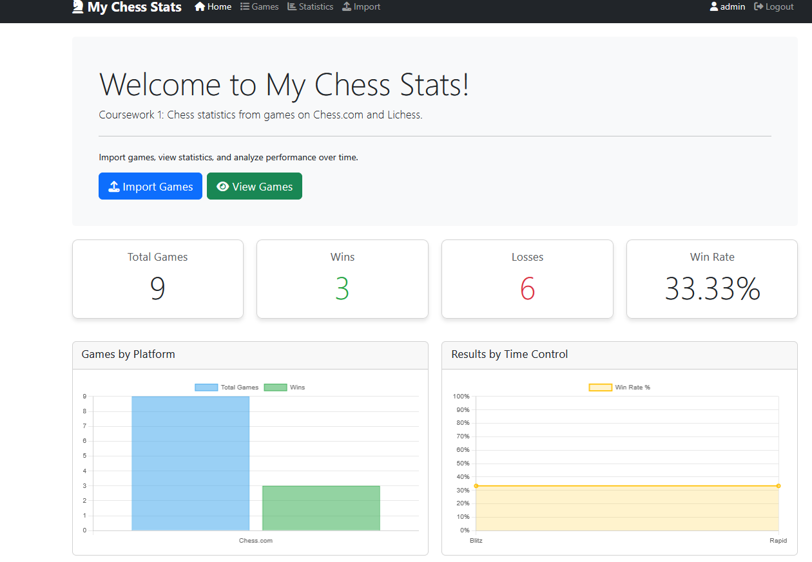
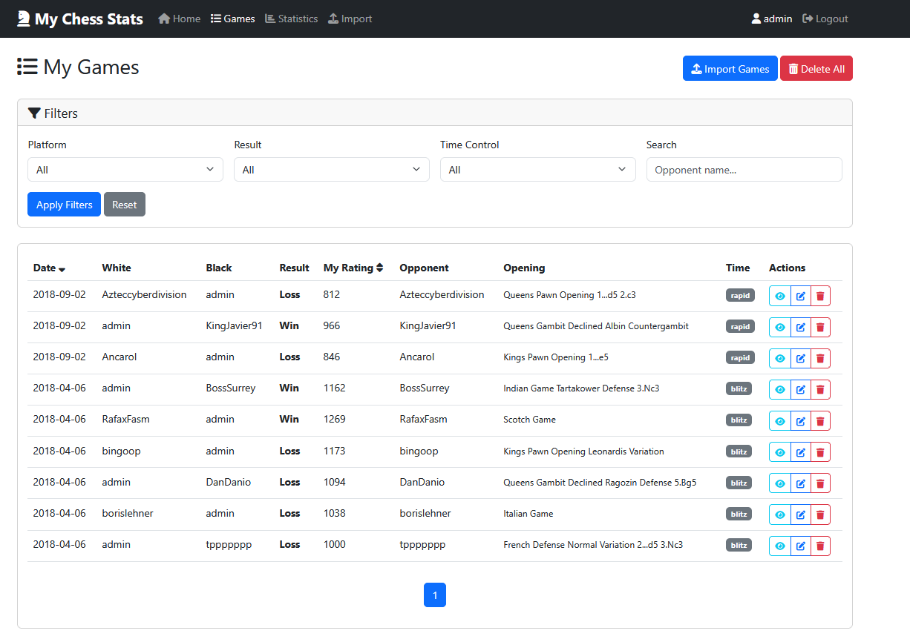
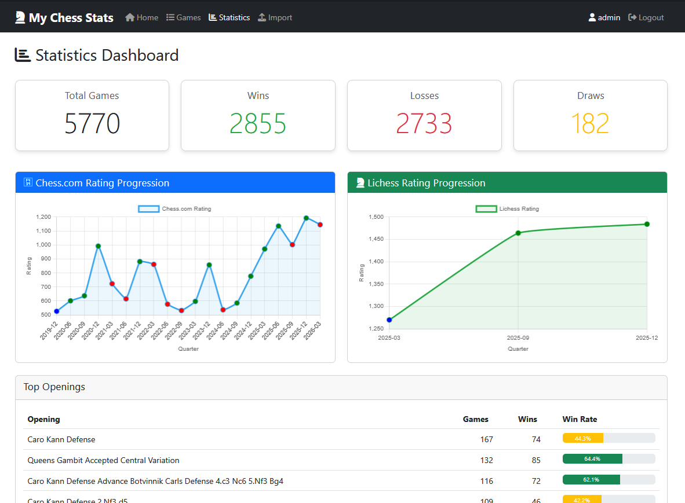

# My Chess Stats

A comprehensive web application for tracking and analyzing chess games from Chess.com and Lichess. Import your games, visualize your progress, and gain insights into your playing patterns.


## Screenshots




## Documentation
[Documentation](api_docs.pdf)
[Technical report](technicalreport.pdf)
[Demo video](https://drive.google.com/file/d/1kyXpypuszL00K9C8InChk7PK--Mn9kzD/view?usp=drive_link)
## Features

### User Authentication
- Secure registration with real-time validation
- AJAX-powered login
- User-specific data 

### Game Management
- View all games in sortable/filterable table
- Detailed game view with chess board visualization
- Edit game details
- Single game or bulk delete

### Import Games
- **Chess.com**: CSV file import with automatic result detection
- **Lichess**: PGN file import with username matching
- Detailed error reporting

### Statistics Dashboard
- Win/loss/draw counts with visual indicators
- Rating progression charts (Chess.com vs Lichess)
- Platform comparison (games count, win rates)
- Top openings with win rate progress bars

### Additional Features
- Responsive Bootstrap 5 design
- RESTful API with Django REST Framework
- Chart.js for interactive data visualization
- Django admin integration

## Quick Start

### Prerequisites
- Python 3.13.12
- pip
- virtualenv (recommended)

### Installation

1. **Clone the repository**
   ```
   git clone https://github.com/YordiKings/coursework1
   cd coursework1\MyChessStats
   ```

2. **Create and activate virtual environment**
   ```
   python -m venv venv
   # On Windows
   venv\Scripts\activate.bat
   # On macOS/Linux
   source venv/bin/activate
   ```

3. **Install dependencies**
   ```
   pip install -r requirements.txt
   ```

4. **Run migrations**
   ```
   python manage.py makemigrations
   python manage.py migrate
   ```

5. **Create superuser (optional, for admin access)**
   ```
   python manage.py createsuperuser
   ```

6. **Start development server**
   ```
   python manage.py runserver
   ```

7. **Visit the application**
   - Main site: http://127.0.0.1:8000/
   - Admin interface: http://127.0.0.1:8000/admin/

## Usage Guide

### First Time Setup
- Register a new account at `/register/`
- Log in with your credentials

### Importing Games

#### Chess.com Import
- Go to https://chessinsights.xyz/ to export Chess.com games
- Download your games as CSV
- Navigate to Import page
- Select "Chess.com CSV" tab
- Upload your CSV file
- Click "Import Chess.com Games"

#### Lichess Import
- Go to Lichess.org → Profile → Games → Export
- Download as PGN
- Navigate to Import page
- Select "Lichess PGN" tab
- Enter your Lichess username
- Upload PGN file
- Click "Import Lichess Games"

### Managing Games
- **View all games**: Navigate to Games page
- **Filter games**: Use platform, result, time control filters
- **Search**: Search by opponent name
- **Sort**: Click on Date or My Rating headers
- **View details**: Click the eye icon on any game
- **Edit**: Click the pencil icon to modify game details
- **Delete**: Click trash icon
- **Delete all**: Use "Delete All" button (requires confirmation)

### Analyzing Statistics
Visit the Statistics page for comprehensive analysis:
- Overall win/loss/draw counts
- Rating progression over time (grouped quarterly)
- Platform comparison charts
- Top openings with win rates

## Project Structure

```
mychessstats/
├── WebChessStats/               # Main application
│   ├── templates/
│   │   └── WebChessStats/       # HTML templates
│   │       ├── base.html         # Base template with navigation
│   │       ├── home.html         # Landing page
│   │       ├── game_list.html    # Games listing
│   │       ├── game_detail.html  # Individual game view
│   │       ├── game_edit.html    # Edit game form
│   │       ├── game_form.html    # Create game form
│   │       ├── import.html       # Import interface
│   │       ├── stats.html        # Statistics dashboard
│   │       ├── login.html        # Login form
│   │       └── register.html     # Registration form
│   ├── admin.py                  # Admin configuration
│   ├── apps.py                   # App configuration
│   ├── models.py                 # Game data model
│   ├── views.py                  # Core logic and API
│   ├── serializers.py            # DRF serializers
│   ├── importers.py              # Chess.com/Lichess import logic
│   ├── board_utils.py            # FEN to SVG conversion
│   ├── urls.py                   # Route configuration
│   └── tests.py                  # Test cases
├── mychessstats/                 # Project settings
│   ├── settings.py
│   ├── urls.py
│   └── wsgi.py
├── manage.py
├── requirements.txt
└── README.md
```

## Technology Stack

### Backend
- Django 4.2.9 - Web framework
- Django REST Framework 3.16.1 - API development
- python-chess - Chess logic and PGN parsing
- SQLite - Development database (configurable for production)

### Frontend
- Bootstrap 5 - UI components and responsive design
- JavaScript (Vanilla) - Dynamic interactions and API calls
- Chart.js - Data visualization
- Font Awesome 6 - Icons

## API Endpoints

All API endpoints require authentication and return JSON.

| Endpoint              | Method | Description                          |
|-----------------------|--------|--------------------------------------|
| `/api/games/`         | GET    | List user's games (filterable)       |
| `/api/games/`         | POST   | Create new game                      |
| `/api/games/{id}/`    | GET    | Retrieve specific game               |
| `/api/games/{id}/`    | PUT    | Update game                          |
| `/api/games/{id}/`    | DELETE | Soft delete game (?hard=false)       |
| `/api/games/import/`  | POST   | Bulk import games                    |
| `/api/games/stats/`   | GET    | Get user statistics                  |
| `/api/games/{id}/pgn/`| GET    | Get PGN format                       |
| `/api/games/delete-all/` | DELETE | Delete all user games             |
| `/game/{id}/board/`   | GET    | Get board visualization              |

### Query Parameters for `/api/games/`
- `platform`: Filter by platform (chesscom/lichess)
- `result`: Filter by result (W/L/D)
- `time_class`: Filter by time control
- `search`: Search opponent name
- `order_by`: Sort field (e.g., -date_played, my_rating)
- `page`: Pagination page number
- `show_deleted`: Include soft-deleted games (true/false)

## Data Model

### Game Fields

| Field            | Type          | Description                          |
|------------------|---------------|--------------------------------------|
| user             | ForeignKey    | User who owns this game              |
| platform         | CharField(2)  | 'CH' or 'LI'                         |
| game_id          | CharField(100)| Unique game identifier               |
| date_played      | DateField     | Game date                            |
| time_class       | CharField(20) | bullet/blitz/rapid/classical         |
| white_player     | CharField(100)| White player name                    |
| black_player     | CharField(100)| Black player name                    |
| my_color         | CharField(5)  | 'white' or 'black'                   |
| result           | CharField(1)  | 'W'/'L'/'D'                          |
| my_rating        | IntegerField  | User's rating                        |
| opponent_rating  | IntegerField  | Opponent's rating                    |
| opponent_name    | CharField(100)| Opponent's name                      |
| opening          | CharField(200)| Opening name                         |
| fen              | CharField(100)| Final position FEN                   |
| pgn              | TextField     | Full PGN                             |
| is_active        | BooleanField  | Soft delete flag                     |

